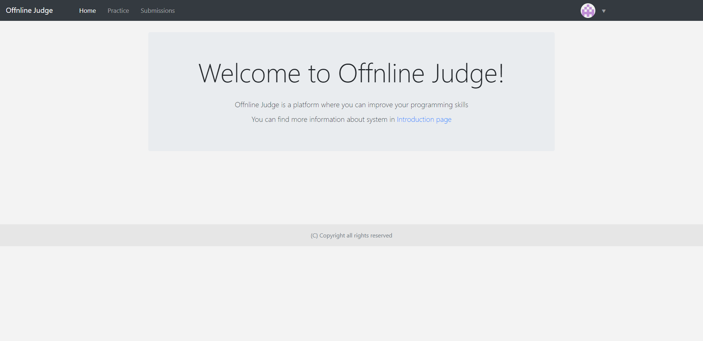

# Offnline judge



Offnline judge is a platform where you can improve your programming skills and learn new algoritms. 
The platform includes a `testing system`, `archive of tasks`, `statistics of users` and their `submissions`

## Getting Started

* First download project, install `python 3.6(or higher)` and all required libraries by running command below:
```
pip install -r requirements.txt
```
* Download [wingw compiler](https://osdn.net/projects/mingw/releases) if it is not installed
* Add mingw to system PATH variable
* Launch application and open [link](http://localhost:8080)
```
python3 server.py
```
### Submissions
You can register new account or login into existing account
To submit solutions required to be registered in the system.
Go to the practice section choose problem to submit. The solution can be written in the built-in editor or pasted from the clipboard.
When solution submitted, wait until your solution is tested. When it's tested **submission status** will change. To see more about status meaning go to [link](http://localhost:8080/introduction)

### Profile
In your profile, you can see your `submissions accuracy`, which `problems you solved`, which `problems you unsolved`
Also you can `edit your profile`: change email and password, set up new icon

### API
With api you can get information about `users`, `problems` and `submissions`.
To get information about all users run project and go to the [link](http://localhost:8080/api/v1/users)
To get information about one user go to the [link](http://localhost:8080/api/v1/user/1)
> To get information about **submissions** or **problems** use the same syntax

***

## Technologies
To create this project following libraries following technologies were used:
* [Flask framework](https://flask.palletsprojects.com/en/1.1.x/)
* [WT forms](https://wtforms.readthedocs.io/en/2.3.x/)
* [multiprocessing](https://docs.python.org/2/library/multiprocessing.html)
* [Postgresql](https://www.postgresql.org/)

## Authors

* **Ponomarev Mikhail** - [ZyMa-1](https://github.com/ZyMa-1)

## License

This project is licensed under the MIT License - see the [LICENSE](LICENSE) file for details
